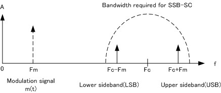
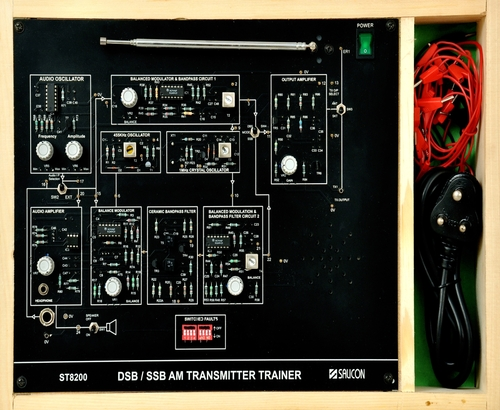
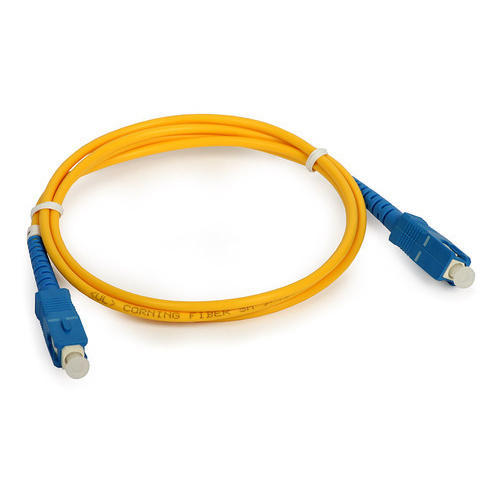
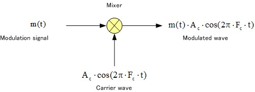
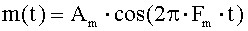
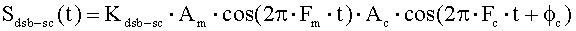

## Storyboard (Round 2)

Experiment 1: DSB/SSB amplitude modulation

### 1. Story Outline:

The experiment is based on DSB-SC which is a double sideband suppressed carrier modulation and SSB-SC is single sideband suppressed carrier modulation.
When amplitude modulation is carried out, the modulating signal spectrum is shifted to the carrier frequency band. DSB-SC is so named because the modulating signal extends symmetrically on both sides of the carrier wave. SSB-SC is DSB-SC with only one side band.

The objective of the experiment is to study DSB/SSB amplitude modulation and determine its modulation factor.
### 2. Story:

Double sideband suppressed carrier modulation
At the beginning of the explanation of amplitude modulation, we explained the AM radio system, but the term for amplitude in the theoretical expression was complex. If the amplitude of the carrier wave is simply changed and mathematised, it is as follows. This modulation method is called DSB-SC (double sideband suppressed carrier modulation). As the name suggests, there’s no wave carrier in the modulated wave.

 

Single sideband suppressed carrier modulation (SSB-SC)
The modulation method where only a single band of double sideband suppressed carrier modulation is transmitted is known simply as SSB. It offers even better electrical efficiency and frequency band efficiency than DSB. In addition, with digital modulation, modulation is performed at relatively low frequency, and this method is also used to up-convert the signal to a radio frequency. SSB-SC modulation can be achieved with various systems, but in terms of hardware, USB or LSB can be used as a filter. As with DSB-SC, the modulating signal spectrum is shifted directly to the carrier frequency band without loss.
 
 1.	Amplitude modulation: Modulation is a process of translating information signal from low band frequency to high band frequency that is suits the transmission medium. Information signal is usually of low frequency, so it cannot travel far. It needs a carrier signal of higher frequency for long distance destination. The inputs are carrier and information (modulating) signals while the output is called the modulated signal. Amplitude Modulation (AM) refers to the modulation technique where the carrier’s amplitude is varied in accordance to the instantaneous value of the modulating or baseband signal’s amplitude. An AM signal is represented as:

Sinusoidal carrier wave C(t) given as:
   c(t) = A cos wct	A = Max amplitude of the carrier wave
   Wc = carrier frequency
AM wave can be expressed as:
   s(t) = x(t) cos wct + A cos wct s(t) = [A + x(t) ] cos wct

2.	Modulation Index: The amount by which the amplitude of the carrier wave increases and decreases depends on the amplitude of the information signal and is known as modulation index or depth of modulation. The extent of amplitude variation in AM about a unmodulated carrier amplitude is measured in terms of a factor called modulation index.

  m = Vmax-Vmin	X 100 % Vmax+ Vmin
3.	Double side band transmitter: The transmitter circuit produces the AM signal which is used to carry information over transmission to the receiver.
 

#### Apparatus
1.	DSB/SSB	AM transmitter kit

2.	CRO  
3.	Patch cords 

 

#### With following specifications,

1.	DSB/SSB	AM transmitter kit	(ST2201)
2  CRO as required by the DSB/SSb transmitter
3.	Patch cords of desired length and required numbers

### 4. User objective goals
1. To study DSB/SSB amplitude modulation.
2. To determine its modulation factor.

### 5. Challenges and Questions
##### 1.	The circuit used for producing AM is called?
  <b> a) Modulator </b> 
  b) Transmitter 
  c) Receiver 
  d) Duplexer
  ANS:-A

##### 2.	In Amplitude Modulation, the instantaneous values of the carrier amplitude changes in accordance with the amplitude and frequency variations of the modulating signal.
  <b> a)	True  </b>
  b) False
  ANS:-A

##### 3.What is the line connecting the positive and negative peaks of the carrier waveform called?
  a) Peak line
  b)	Maximum amplitude ceiling 
  c) Modulation index
  <b>  d) Envelope  </b>
  ANS:-D

##### 4. The ratio between the modulating signal voltage and the carrier voltage is called?
  a) Amplitude modulation
  b) Modulation frequency 
  c)  <b> Modulation index  </b>
  d) Ratio of modulation
  ANS:-C

##### 5:- What happens when the amplitude of the modulating signal is greater than the amplitude of the carrier?
  a)  Decay
   <b> b) Distortion  </b>
  c) Amplification
  d) Attenuation 
  ANS:-B

##### 6:- What is the condition for greatest output power at the transmitter without distortion? 
  a) Modulating signal voltage > Carrier voltage
  b) Modulating signal voltage < Carrier voltage 
   <b> c) Modulating signal voltage = Carrier voltage  </b> 
  d) Modulating signal voltage = 0
  ANS:-C
 
##### 7:- What is the bandwidth of the signal if the highest frequency in the modulating signal is 3 KHz? 
   <b> a) 6Khz </b>
  b) 3KHz
  c)  5Khz
  d) 140Khz
  ANS:-A

##### 8:- What is the wave of frequency that occurs at the sum and difference of the carrier and modulating signal is called?
  a) Noise signals
  <b> b) Sideband </b>
  c)  Extraband 
  d) Neutral band 
  ANS:-B

### 6. Formulas and equations used :

Formulas:  

 

 

 

  

<b>Modulation Index m =  ×100 %</b> 
<b>Power of Carrier Signal Pc = Ac²/2 </b>  
<b>Power of Side Band Ps = Pc[1+ ma²/2] </b> 
<b>Total power, P = Pc + Ps</b>

### 7. Conclusion:
####  Study of DSB/SSB AM signal has been done. 
       a) Modulation Index has been calculated.
       b) Power in the side bands has been determined.

